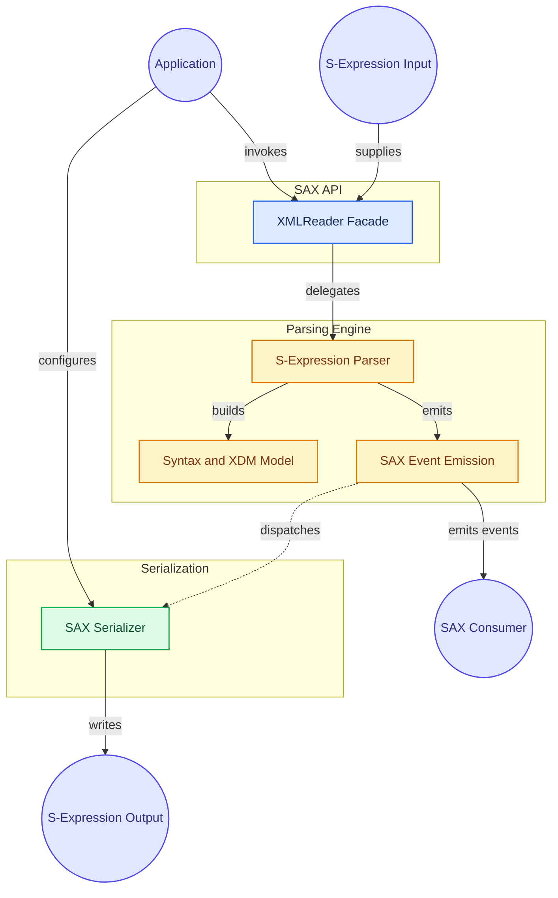

# Architecture Overview xml-sax-sexpr

```mermaid
flowchart TD

    subgraph group_api["SAX API"]
        node_xml_reader["XMLReader Facade"]
    end

    subgraph group_engine["Parsing Engine"]
        node_parser["S-Expression Parser"]
        node_syntax_model["Syntax and XDM Model"]
        node_event_emission["SAX Event Emission"]
    end

    subgraph group_output["Serialization"]
        node_serializer["SAX Serializer"]
    end

    node_application(("Application"))
    node_sexpr_input(("S-Expression Input"))
    node_sax_consumer(("SAX Consumer"))
    node_sexpr_output(("S-Expression Output"))

    node_application -->|"invokes"| node_xml_reader
    node_application -->|"configures"| node_serializer
    node_sexpr_input -->|"supplies"| node_xml_reader
    node_xml_reader -->|"delegates"| node_parser
    node_parser -->|"builds"| node_syntax_model
    node_parser -->|"emits"| node_event_emission
    node_event_emission -.->|"dispatches"| node_serializer
    node_event_emission -->|"emits events"| node_sax_consumer
    node_serializer -->|"writes"| node_sexpr_output

    click node_xml_reader "https://github.com/jurgenei/xml-sax-sexpr/blob/main/src/main/java/name/jurgenei/xml/sexpr/SExpressionXmlReader.java"
    click node_parser "https://github.com/jurgenei/xml-sax-sexpr/blob/main/src/main/java/name/jurgenei/xml/sexpr/SExpressionParser.java"
    click node_syntax_model "https://github.com/jurgenei/xml-sax-sexpr/blob/main/src/main/java/name/jurgenei/xml/sexpr/SExpressionParser.java"
    click node_event_emission "https://github.com/jurgenei/xml-sax-sexpr/blob/main/src/main/java/name/jurgenei/xml/sexpr/SExpressionParser.java"
    click node_serializer "https://github.com/jurgenei/xml-sax-sexpr/blob/main/src/main/java/name/jurgenei/xml/sexpr/SExpressionSerializer.java"

    classDef toneNeutral fill:#f8fafc,stroke:#334155,stroke-width:1.5px,color:#0f172a
    classDef toneBlue fill:#dbeafe,stroke:#2563eb,stroke-width:1.5px,color:#172554
    classDef toneAmber fill:#fef3c7,stroke:#d97706,stroke-width:1.5px,color:#78350f
    classDef toneMint fill:#dcfce7,stroke:#16a34a,stroke-width:1.5px,color:#14532d
    classDef toneRose fill:#ffe4e6,stroke:#e11d48,stroke-width:1.5px,color:#881337
    classDef toneIndigo fill:#e0e7ff,stroke:#4f46e5,stroke-width:1.5px,color:#312e81
    classDef toneTeal fill:#ccfbf1,stroke:#0f766e,stroke-width:1.5px,color:#134e4a
    class node_xml_reader toneBlue
    class node_parser,node_syntax_model,node_event_emission toneAmber
    class node_serializer toneMint
    class node_application,node_sexpr_input,node_sax_consumer,node_sexpr_output toneIndigo
```